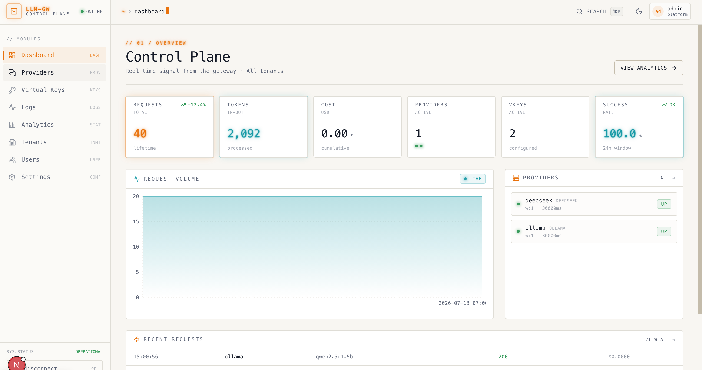

# LLM Gateway

<p align="center">
  <strong>English</strong> ·
  <a href="README.zh-CN.md">中文</a> ·
  <a href="docs/api.md">API Reference</a> ·
  <a href="LICENSE">License</a>
</p>

LLM Gateway is a unified LLM API gateway built with Go. It exposes one OpenAI-compatible API for multiple model providers, with virtual keys, usage tracking, caching, routing, and an admin dashboard.

## What You Can Do

- Call multiple providers through OpenAI-compatible endpoints such as `/v1/chat/completions`
- Issue virtual keys to applications and track usage, budgets, and request logs by key
- Route traffic across providers and models with load balancing, fallback, and conditional routing
- Enable in-memory or Redis caching to reduce repeated request cost
- Manage providers, virtual keys, tenants, users, alerts, and analytics from the Next.js dashboard



## Quick Start

### 1. Install dependencies

```bash
make deps
```

### 2. Configure a provider

The default config file is `configs/config.yaml`. Local development uses Ollama by default:

```yaml
gateway:
  defaultProvider: ollama
  providers:
    ollama:
      provider: ollama
      customHost: http://localhost:11434/v1
```

For a cloud provider, update `provider`, `apiKey`, and `customHost` as needed.

### 3. Start the services

```bash
make dev
```

- Backend API: `http://localhost:8080`
- Admin dashboard: `http://localhost:3000`
- Default admin user: `admin / admin123` (change this in production)

Run in the background:

```bash
make start
# stop
make stop
```

### 4. Create a virtual key and call the API

Create a virtual key in the dashboard, then use it with the OpenAI-compatible API:

```bash
curl -X POST http://localhost:8080/v1/chat/completions \
  -H "Content-Type: application/json" \
  -H "x-llm-gateway-api-key: your-virtual-key" \
  -d '{
    "model": "llama3",
    "messages": [{"role": "user", "content": "Hello!"}]
  }'
```

## Architecture


### Request flow

```text
Client
  -> /v1/*
  -> Virtual Key Auth
  -> Guardrail / Idempotency / Usage Record / Cache
  -> Proxy Handler
  -> Routing Engine
  -> Provider Adapter
  -> Upstream LLM API
```

## API Reference

- [API Reference](docs/api.md)
- OpenAI-compatible APIs use the `x-llm-gateway-api-key` virtual key header
- Admin APIs use `Authorization: Bearer <token>` JWT authentication

## Core Capabilities

| Capability             | Description                                                                                                          |
| ---------------------- | -------------------------------------------------------------------------------------------------------------------- |
| Multi-provider support | Built-in adapters for OpenAI, Anthropic, Gemini, Azure, DeepSeek, Groq, Mistral, Kimi, GLM, Cohere, Ollama, and more |
| Unified API            | Exposes OpenAI-compatible endpoints to reduce integration work                                                       |
| Virtual keys           | Protect real provider keys and track usage and budgets per gateway key                                               |
| Routing strategies     | Supports single provider, load balancing, fallback, and conditional routing                                          |
| Caching                | Supports in-memory and Redis cache backends                                                                          |
| Multi-tenancy          | Supports tenants, users, roles, and tenant-scoped data isolation                                                     |
| Observability          | Provides request logs, usage records, analytics, and Prometheus metrics                                              |

## Common Commands

| Command               | Description                                  |
| --------------------- | -------------------------------------------- |
| `make deps`         | Install backend and frontend dependencies    |
| `make dev`          | Start backend and frontend in the foreground |
| `make start`        | Start backend and frontend in the background |
| `make stop`         | Stop local services                          |
| `make build`        | Build the backend binary and frontend assets |
| `make test`         | Run Go unit tests                            |
| `make fmt`          | Format Go code                               |
| `make seed-demo`    | Generate demo data                           |
| `make traffic-demo` | Generate demo traffic                        |
| `make load-test`    | Run load-test scenarios                      |

## Project Structure

```text
llm-gateway/
├── cmd/server/              # Server entrypoint and route registration
├── internal/
│   ├── config/              # Configuration loading
│   ├── database/            # GORM database layer
│   ├── handler/             # HTTP handlers
│   ├── middleware/          # Gin middleware
│   ├── models/              # Data models
│   ├── provider/            # LLM provider adapters
│   ├── routing/             # Routing strategies
│   └── service/             # Business services
├── pkg/
│   ├── cache/               # Memory / Redis cache
│   ├── guard-rail/          # Request / response guardrails
│   ├── proxy/               # Core proxy logic
│   └── retry/               # Retry logic
├── web/frontend/            # Next.js admin dashboard
├── configs/config.yaml      # Default configuration
└── Makefile                 # Local development commands
```

## Open Source

Issues and pull requests are welcome. Before submitting changes, run:

```bash
make test
make fmt
```

If you add a provider, routing strategy, or management API, please update the related documentation and tests.

## Security

- Do not commit real API keys, JWT secrets, or production configuration
- Change the default admin password and `security.jwtSecret` in production
- If you find a security issue, contact the maintainers privately before publicly disclosing exploitable details

## License

MIT License. See [LICENSE](LICENSE).
